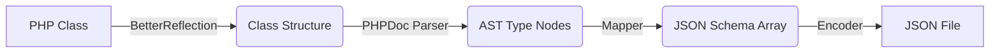

# Architecture: PHPStan-First JSON Schema Generator

## 1. Core Concept

This library aims to be the **Single Source of Truth** for JSON Schema generation in PHP projects. Instead of maintaining separate YAML files or relying on runtime reflection, we treat **PHP Code (Static Types, PHPDoc, Attributes)** as the definitive schema definition.

### Key Principles
- **Static Analysis (AOT)**: We use static analysis to generate schemas. This means no code is executed during generation, making it safe and performant. Runtime reflection (`ReflectionClass`) is strictly prohibited.
- **PHPStan Compatibility**: We respect PHPStan's type system. Types like `int<1, 10>` or `non-empty-string` are automatically converted to JSON Schema validation constraints (`minimum`, `minLength`).
- **Standard Compliance**: The output is strictly compliant with **JSON Schema Draft 2020-12** and **OpenAPI 3.1**.

## 2. Component Architecture

The generation process follows a linear pipeline:

### 2.1. Reflector (`Roave\BetterReflection`)
The entry point. It reads PHP files and constructs an object model of classes, properties, and methods without loading them into PHP's memory. This ensures that the generation process is isolated from the application's runtime state.

### 2.2. Type Parser (`phpstan/phpdoc-parser`)
Extracts rich type information from DocBlocks.
- **Input**: `/** @var int<1, 10> $age */`
- **Output**: `IntegerRangeTypeNode(min: 1, max: 10)`

### 2.3. Schema Generator (Mapper)
The core logic layer. It traverses the class structure and maps PHP types to JSON Schema keywords.
- `int` -> `type: integer`
- `string` -> `type: string`
- `?string` -> `type: ["string", "null"]`
- `MyClass` -> `$ref: "#/$defs/MyClass"`

## 3. Development Workflow

We adopt a **Test-Driven Development (TDD)** approach using Fixtures.

1.  **Define Input**: Create a PHP class in `tests/Fixtures/Input/`.
2.  **Define Expected Output**: Create the corresponding JSON file in `tests/Fixtures/Expected/`.
3.  **Implement**: Write the parser logic to make the input match the output.

## 4. Why this architecture?

| Feature | Runtime Reflection | Static Analysis (This Lib) |
| :--- | :--- | :--- |
| **Performance** | Fast (Memory heavy) | Slower (Disk I/O heavy) |
| **Safety** | Execution side-effects | **Zero side-effects** |
| **Type Detail** | Low (only native types) | **High (Generics, Ranges)** |
| **Dependencies** | Requires autoloader | **Standalone** |

By choosing Static Analysis, we enable advanced features like:
- Validating schema against code at build time.
- Supporting complex types that PHP runtime ignores (Generics, Shapes).
- Generating schemas for code that might not even be runnable in the generator's environment.
