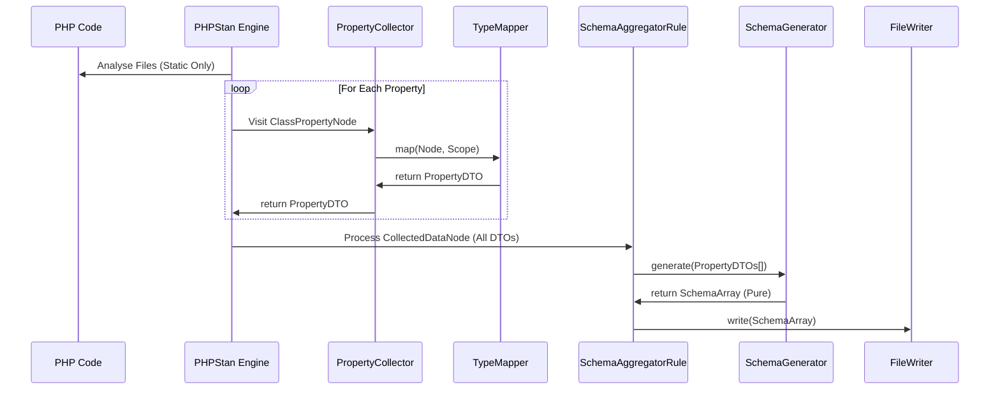

# Architecture: PHPStan-First JSON Schema Generator

## 1. Core Concept

This library generates JSON Schema directly from PHP code by leveraging **PHPStan's native type inference engine**.

### Key Principles
- **PHPStan Native**: We run as a PHPStan extension to ensure 100% compatibility with its type system.
- **No Runtime Reflection**: We strictly avoid PHP's native reflection (`new ReflectionClass`). All information is extracted via static analysis (AOT), ensuring that user classes are never instantiated or even loaded during generation.
- **Separation of Concerns**: Analysis, Mapping, Generation, and I/O are strictly separated.
- **Pure Logic**: The core `SchemaGenerator` is a pure function with no side effects.

## 2. Component Architecture

### 2.1. TypeMapper (`Service`)
- **Responsibility**: The Heavy Lifter. Converts complex `PHPStan\Type` objects into framework-agnostic DTOs.
- **Logic**: Handles `IntegerRangeType`, `UnionType`, `Generics`, etc.

### 2.2. PropertyCollector (`PHPStan Collector`)
- **Responsibility**: Interface. Delegates mapping to `TypeMapper` and returns the resulting DTO to PHPStan.

### 2.3. SchemaAggregatorRule (`PHPStan Rule / Controller`)
- **Responsibility**: Orchestration. Aggregates data and handles I/O.

### 2.4. SchemaGenerator (`Service`)
- **Responsibility**: **Pure Function**. Converts DTOs into JSON Schema structure. No PHPStan or I/O dependencies.

## 3. Why this architecture?

| Feature | Runtime Reflection Approach | This Library (PHPStan Native) |
| :--- | :--- | :--- |
| **Runtime Overhead** | **High** (Parses code on every request) | **Zero** (Uses pre-generated schema) |
| **Safety** | Execution side-effects possible | **Zero side-effects** (Code is never run) |
| **Type Detail** | Low (Native types only) | **High** (Ranges, Shapes, Generics) |
| **Dependencies** | Requires class loading | **Standalone Static Analysis** |

By leveraging PHPStan's engine without using runtime reflection, we can support advanced types that are invisible to the PHP runtime while maintaining maximum performance and safety.