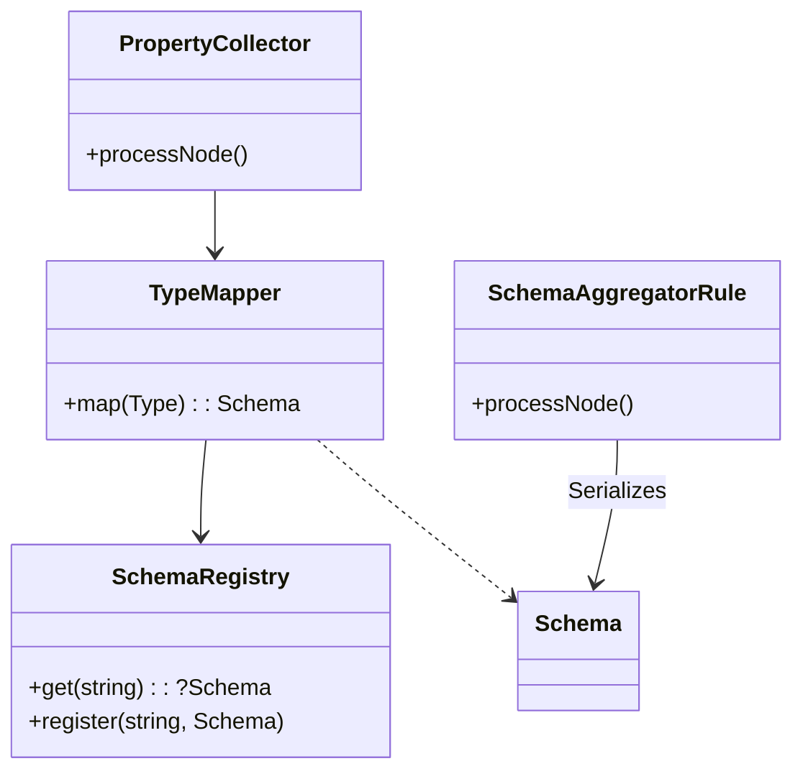

# Architecture: PHPStan-First JSON Schema Generator

## 1. Core Concept

This library generates JSON Schema directly from PHP code by leveraging **PHPStan's native type inference engine**.

### Key Principles
- **PHPStan Native**: We run as a PHPStan extension to ensure 100% compatibility with its type system.
- **No Runtime Reflection**: We strictly avoid PHP's native reflection (`new ReflectionClass`).
- **Immutable Domain Models**: Schema definitions are represented as immutable Value Objects.
- **Encapsulated Logic**: Generation logic is encapsulated within Schema objects via `JsonSerializable`.

## 2. Component Architecture

### 2.1. Domain Layer (Schema Value Objects)
Immutable objects representing JSON Schema definitions. They encapsulate validation constraints and JSON serialization logic.

- **Schema (Interface)**: Extends `JsonSerializable`.
- **SchemaMetadata (VO)**: Holds type-agnostic documentation fields (`title`, `description`, `deprecated`, `readOnly`, `writeOnly`).
- **Concrete Schemas**:
  - `IntegerSchema`: Holds `minimum`, `maximum`, `default` (int), `enum` (int[]).
  - `StringSchema`: Holds `minLength`, `pattern`, `format`.
  - `ObjectSchema`: Holds property map.
  - `RefSchema`: Represents `$ref` pointers.

### 2.2. Service Layer

#### TypeMapper (Factory)
- **Responsibility**: Converts PHPStan's `Type` objects into `Schema` Value Objects.
- **Logic**: Handles `IntegerRangeType` -> `IntegerSchema`, `UnionType` -> `OneOfSchema` etc.

#### SchemaRegistry
- **Responsibility**: Manages recursion and caching.
- **Features**:
  - Detects circular references.
  - Returns `RefSchema` for already processed types.
  - Maps FQCNs to Schema paths (e.g., `#/components/schemas/UserDto`).

### 2.3. PHPStan Integration

#### PropertyCollector
- Visits `ClassPropertyNode`.
- Uses `TypeMapper` to create a `PropertyDTO` containing the resolved `Schema`.
- Returns the DTO to PHPStan.

#### SchemaAggregatorRule
- Aggregates collected DTOs.
- Orchestrates the final JSON file generation.

## 3. Data Flow

1.  **Analysis**: PHPStan analyzes the source code.
2.  **Collection**: `PropertyCollector` visits properties.
3.  **Mapping**: `TypeMapper` converts PHPStan types to `Schema` objects, using `SchemaRegistry` to handle references.
4.  **Aggregation**: `SchemaAggregatorRule` gathers all schemas.
5.  **Serialization**: `json_encode()` is called on the root objects, triggering recursive `jsonSerialize()` calls on the Schema tree.
